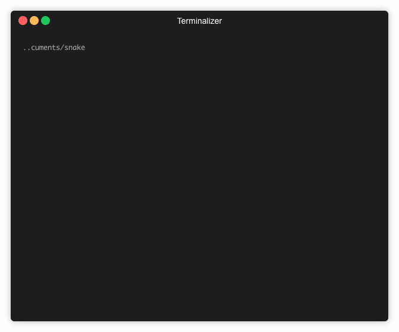

# Snake


A parallel, abstract, ~~completely overengineered~~ snake game engine, with pre-built adapters for supporting different clients.

Simulate multiple snake games in parallel as a large set of finite state machines. Abstracted over directional input returning state changes. Each game has a unique board size and tick rate. Allowing it to support games across varied clients using custom adapters.

## Demos
**Demo of the [web](./web) adapter: [here](http://dev.tomarrell.com:8081)**

*Note*: The server for the web demo hosted in `us-east` region, so if you are located too far from the region latency will start to play a role. If you don't want to spin up a machine for each region, have a look at the [validator](./validator) adapter, which is capable of verifying a client side simulation.

**Demo of the [term-snake](./term-snake) adapter:**


## Overview
The core of the project can be found within `./engine`, with the adapters occupying the sibling directories. This models allows for arbitrary clients to interface with the engine.

**Depending on your use case, a particular adapter may already be applicable.**

**[web](./web)** - The web adapter implements a websocket interface on top of the engine. This spins up a server which runs a game per connection. Each connection is isolated, and cannot affect the game of any other connection. The adapter provides a set of messages to provide game input, and send state messages back to the client. The entire simulation occurs on the server, with the client only being required to implement the render and input relay logic, an example in *&#60;100* lines can be found [here](./web/static/index.html). This however does leave you at the mercy of the latency between the client and server. Anecdotal testing finds an acceptable range of up to `~150ms`.

**[validator](./validator)** - The validator adapter provides the ability for the engine to confirm a series of "ticks" given to it by a client. A tick represents a single state change within the game (*the snake moving a single position in any direction*). The adapter is built to receive a description of the start of a game, which it generates fruit for, signs, and returns. This signature must be returned in all further requests. The client then records the ticks taken to move to the piece of randomly generated fruit, and sends this along with other information and the signature back to the server for validation. The benefit of this approach is that the server remains stateless regardless of how many games are being played simultaneously.

**[term-snake](./term-snake)** - Proof of concept in the terminal. Not a particularly useful adapter, but a good example of the versatility of the adapters on top of the engine.

## Installation
You can build your own adapter by importing `github.com/tomarrell/snake` and then using the exported methods there to build your own adapter on top of the simulation.

Alternatively, you can use one of the pre-built adapters. Currently built adapters are:
- Terminal
- Web
- Validator

In order to play around with the terminal adapter, run the following.
```bash
> go get github.com/tomarrell/snake/term-snake
> term-snake
```

Just make sure you have your `$GOPATH` setup and `$PATH` pointing to `$GOPATH/bin`.

To run a copy of of the included web adapter, run the following.
```bash
> go get github.com/tomarrell/snake/term-snake
> web
```
This will run the web adapter on port `8080`. You can test out the basic client in your browser by navigating to `http://localhost:8080`. API and socket documentation for implementing your own client can be found in [web/README.md](./web/README.md).

## TODO

#### Core
- [x] Engine creation
- [x] Game creation
- [x] Game ending
- [x] Snake logic
- [x] Input handling
- [x] State output
- [x] Fruit
- [ ] Snake collisions with itself

#### Adapters
- [x] Basic terminal interface
- [x] Web server
- [x] Validator
- [ ] Leaderboard

## License
Licensed under MIT or GPLv3.0, whichever you prefer.
